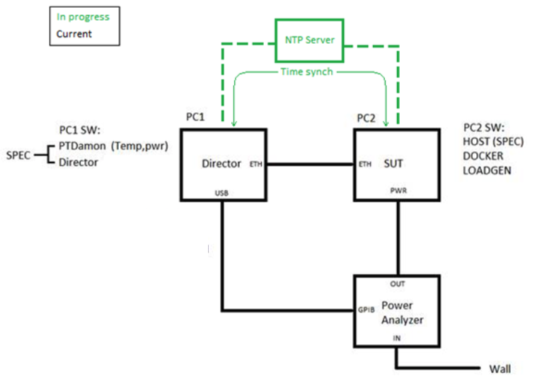

:toc:
:toclevels: 4

:sectnums:

= MLPerf Inference Power Specification

Version 0.5 August 7, 2019

Points of contact: Bing Yu (Bing.Yu@mediatek.com), Hanlin Tang (hanlin.tang@intel.com),
David Kanter (dkanter@gmail.com), Tejus Rajan (arun.tejusve.raghunath.rajan@intel.com),
Vijay Janapa Reddi (vj@eecs.harvard.edu), Debajyoti Pal (dpal@cadence.com),
Carole-Jean Wu (carolejeanwu@fb.com)

== Goals

This draft document describes the power measurement procedure for MLPerf Inference
Suite v0.5 only. The main goals are as follows:

* Initial v0.5 power measurement methodology for wall-powered systems that emphasizes minimal effort
* Identify longer term goals that are candidates for later iterations (e.g., v1.0)
* Re-use existing SPECPower recommended methodology as much as possible.
* Balance reproducibility, accuracy, and fairness of power methodology against burden imposed on submitters
* Measure the entire system, to include any component that contributes to the performance score (accelerator card, host, networking).

== Requirement and Scope

Submitting power is _optional_ in MLPerf Inference Suite v0.5. Submitters who
wish to submit power must follow this spec. This power specification covers
wall-powered systems only. This power spec is currently only applicable to the
Inference benchmark. We expect future versions will support additional features
to enable its application for the MLPerf Training Suite.

== Power management

The goal of this benchmark is to mimic real-world usage scenarios as much
as possible, and enable demonstrating of the benefits of realistic power
management. Therefore, we require any power management system to:

* Be qualified for use appropriate for the
submission type (e.g., a generally available system must use
software/firmware qualified for general availability and shipping
with the platform)
* Include no benchmark or benchmarking-specific modifications
* Changes in power management behavior must not have manual intervention or
be aware of the benchmark

== Wall-Powered System Under Test

The System under Test (SUT) includes any component that contributes to the
measured performance of the MLPerf benchmark. For example, an
accelerator based system should also include the host node,
networking/switches for distributed systems, number and type of cooling systems,
and hard disks. If the system uses shared resources with multiple servers, the
shared resources must be included in the SUT.

The cooling method must be described (e.g., air-cooling, liquid cooling).

Figure 1 below illustrates details of the MLPerf power measurement configuration.
Note that in contrast to SPECpower, the temperature sensor is not required, and
the collection system is not coupled to the SUT and driving/controlling the SUT.
All power delivered to the SUT must arrive through the power meter.

DC-powered systems are also supported with an appropriate power meter, but may
not be compared to AC-powered systems. If a wall-powered system is available in
both an AC-powered and DC-powered configuration, we require using the
AC-powered configuration.

== Wall-Powered Measurement Procedure

. Connect an approved power meter from this list to the SUT.

 For single enclosure devices (where all the components are
 contained inside a single chassis), connect the power supply
 to the meter. For disaggregated systems, or systems with
 multiple nodes, all power supplies for the SUT components
 must be connected to the power meter. For logging, the
 power meter should be connected to an external computer
 (not in the SUT) which is running the SPEC PTDaemon
 logging software. See Figure 1 above.

 This approach applies to both AC and DC powered systems,
 but the type of power delivery must be specified and AC
 and DC systems cannot be compared to one another due to
 differences in conversion efficiency.

. Synchronize system clock of two systems with Network Time Protocol (NTP)

 More details to be shared as the procedure is being piloted.

. Perform pre-processing of inference data

 As long as pre-processing of inference data is not measured for performance,
 it should be performed ahead of the actual inferencing and not
 measured from a power standpoint.

. Pause the system for two minutes prior to start of the benchmark.

 This allows the system to move to a lower power state after performing the
 pre-processing and before running the benchmark.

. Run the MLPerf Inference benchmark for a specific scenario and model

 The system is running the benchmark and in the 'Active' state. Only a single
 combination of scenario and model may be collected.

. Collect 2 minutes of power with the system at active-idle state, subsequent to
the end of step 5.

 Active idle state is a system state where no benchmark-related tasks (e.g. model creation,
 dataset manipulation) are being performed, similar to the MLperf wall clock definition.
 The system must be able and ready to receive queries and meet the quality-of-service
 requirement dictated by the given scenario.

. If needed, run the MLPerf Inference benchmark for additional scenarios.

== Reporting

Reporting power is optional in v0.5. If a submitter would like to submit power measurements,
the submitter must report:

. Benchmark configuration (scenario and model)
. Performance metric (see table below)
. Active idle power (Watts)
. Power and/or energy metric (see table below)
. Power supply type: AC or DC

.Table Reporting values
|===
|Scenario |Performance Metric |Power/Energy Metric

|Single Stream
|Latency
|Energy and Avg. Power

| Multi-Stream
| Number of inferences per query
| Avg. Power

| Server
| Queries per second
| Avg. Power

| Offline
| Queries per second
| Avg. Power

|===

== Future Improvements

In v0.5, this specification does not have a closed-loop system. Instead, it relies on accurate
time synchronization of the system clocks between the SUT and the power meter to align the
MLPerf LoadGen logs with the power data. Future versions will have an automated closed-loop
system to trigger and synchronize power collection and running the benchmark.

This specification also does not include battery-powered systems, which will be included
in future rounds.

